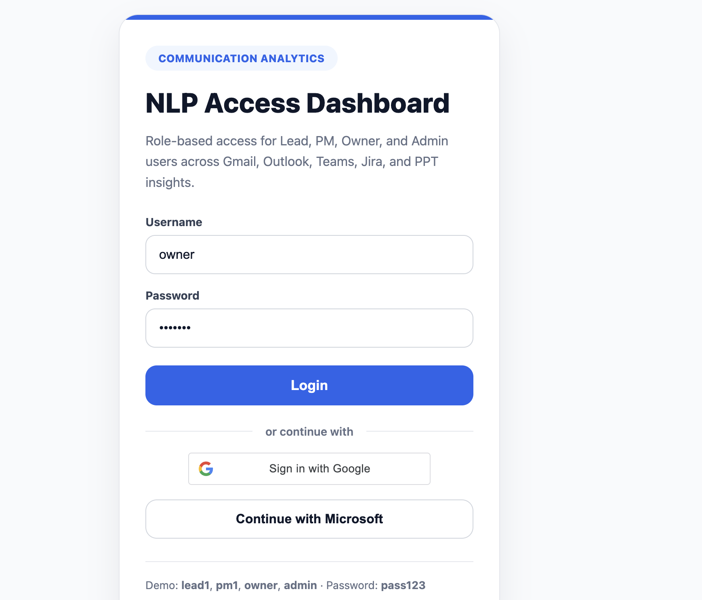
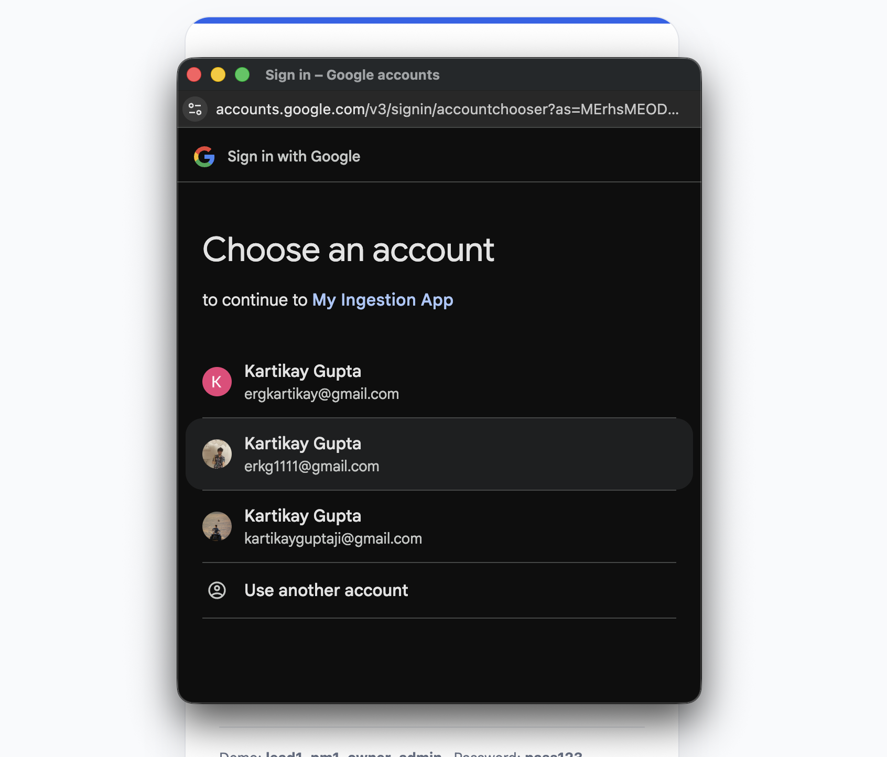
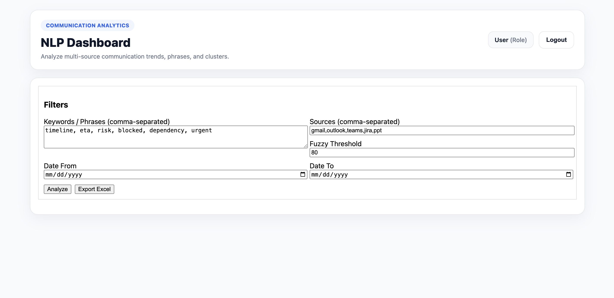
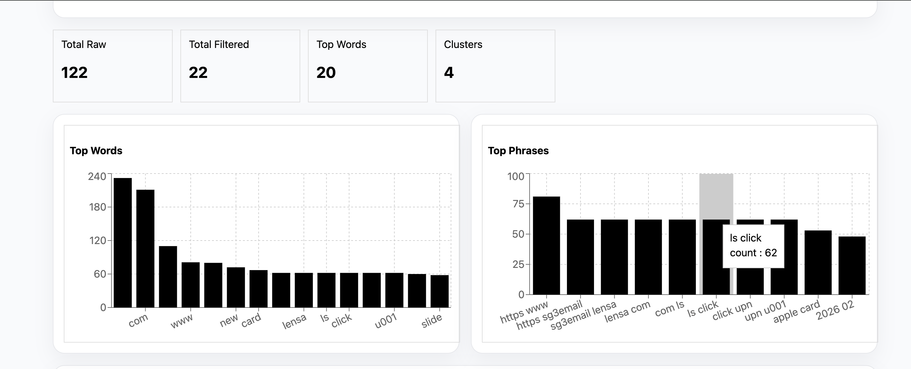
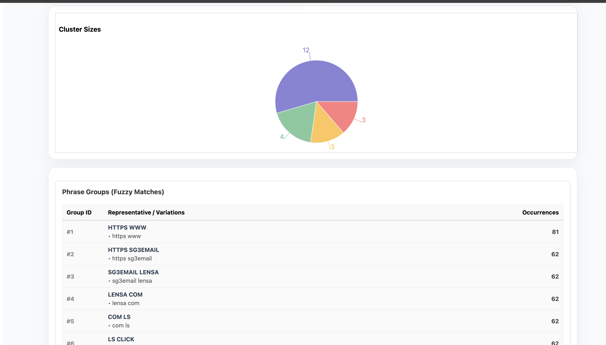
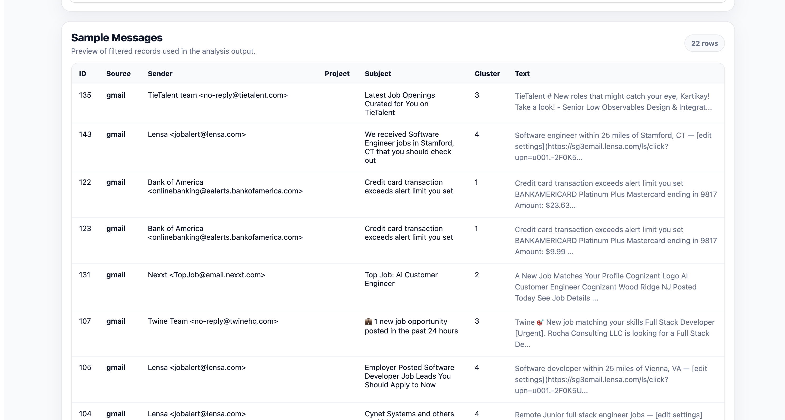

# NLP Dashboard

Full-stack NLP dashboard that ingests Gmail, Outlook, Teams, Jira, and PPT data, applies keyword and fuzzy filtering, extracts top terms and phrases, generates clusters, and exports an Excel report with dashboard-style sheets and charts.

## Overview

NLP Dashboard is a full-stack analytics application built to centralize communication-heavy data from multiple sources into one interface.

The project supports:
- Multi-source ingestion from Gmail, Outlook, Teams, Jira, and PowerPoint content
- Role-based access for Lead, PM, Owner, and Admin users
- Keyword and phrase filtering
- Fuzzy phrase grouping with a configurable threshold
- Top-word and top-phrase extraction
- Cluster analysis
- Excel export for reporting and downstream review

This project combines a Python FastAPI backend, a React frontend, and a database layer for storing and analyzing ingested message data.

---

## Demo

### Login Page

### Google Sign-In

### Dashboard Filters

### Word and Phrase Charts

### Cluster Sizes and Phrase Groups

### Sample Messages Table

---

## Features

### Authentication and Access
- Username/password login
- Google sign-in
- Microsoft sign-in
- Role-based access control for:
  - Lead
  - PM
  - Owner
  - Admin

### Data Ingestion
- Gmail ingestion
- Outlook mail ingestion
- Microsoft Teams ingestion
- Jira ingestion
- Local PPT folder ingestion
- SharePoint PPT ingestion

### NLP and Analysis
- Keyword and phrase filtering
- Fuzzy phrase matching with configurable threshold
- Top words extraction
- Top phrases extraction
- Phrase group generation
- Cluster counts and distribution
- Message previews for filtered records

### Export
- Excel export with:
  - raw data
  - filtered data
  - top words
  - top phrases
  - phrase groups
  - cluster summaries
  - dashboard charts and trend sheets

---

## Tech Stack

### Frontend
- React
- JavaScript
- HTML/CSS
- Charting components for dashboard visualizations

### Backend
- FastAPI
- Python
- SQLAlchemy
- Pandas
- RapidFuzz
- XlsxWriter
- Microsoft Graph / Google APIs

### Database
- MySQL

---

## Project Structure

\`\`\`text
nlp-dashboard/
│
├── Backend/                 # FastAPI backend, ingestion, auth, analysis, export
├── frontend/                # React frontend UI
├── MEDIA/                   # Demo screenshots
└── README.md
\`\`\`

---

## Core Workflow

1. User logs in with demo credentials, Google, or Microsoft.
2. Content is ingested from one or more supported sources.
3. User applies filters:
   - keywords / phrases
   - sources
   - fuzzy threshold
   - date range
4. Backend analyzes the filtered data.
5. Frontend displays:
   - summary metrics
   - top words
   - top phrases
   - cluster sizes
   - phrase groups
   - sample messages
6. User exports the results to Excel.

---

## UI Highlights

- Modern login page with standard and social authentication
- Dashboard header with role display and logout
- Filter panel for keywords, sources, fuzzy threshold, and dates
- KPI summary cards
- Top words and top phrases charts
- Cluster visualization
- Phrase groups table
- Sample messages preview table

---

## Backend Highlights

- FastAPI route-based backend structure
- Multi-source ingestion services
- Role-based query filtering
- NLP/statistical analysis pipeline
- Excel report generation service
- Support for message metadata and audit-style behavior

---

## Example Use Cases

- Track project-related risks, blockers, dependencies, and ETA discussions
- Aggregate signals from multiple communication platforms
- Surface repeated phrases and communication trends
- Export filtered communication intelligence into Excel for reporting

---

## Demo Credentials

Seeded demo users include:
- lead1
- pm1
- owner
- admin

Password:
- pass123

---

## Environment Variables

Create environment files for frontend and backend as needed.

### Frontend (`frontend/.env`)
\`\`\`env
REACT_APP_GOOGLE_CLIENT_ID=your_google_client_id
REACT_APP_MICROSOFT_CLIENT_ID=your_microsoft_client_id
\`\`\`

### Backend
Typical backend configuration includes:
\`\`\`env
DATABASE_URL=your_database_url
GOOGLE_CLIENT_ID=your_google_client_id
GOOGLE_CLIENT_SECRET=your_google_client_secret
MICROSOFT_CLIENT_ID=your_microsoft_client_id
JWT_SECRET=your_secret
\`\`\`

Do not commit real secrets to the repository.

---

## Local Setup

### 1. Clone the repository
\`\`\`bash
git clone https://github.com/Kartikay77/nlp-dashboard.git
cd nlp-dashboard
\`\`\`

### 2. Start the backend
\`\`\`bash
cd Backend
pip install -r requirements.txt
uvicorn main:app --reload
\`\`\`

### 3. Start the frontend
\`\`\`bash
cd frontend
npm install
npm start
\`\`\`

---

## Notes

- This project is designed as a portfolio application demonstrating ingestion, filtering, NLP analytics, dashboarding, and Excel export.
- OAuth setup depends on valid Google and Microsoft app credentials.
- Some enterprise integrations require valid tokens or connector configuration before ingestion.
- Demo screenshots are included in the `MEDIA/` folder.

---

## Future Improvements

- Harden authentication and session management
- Add Docker support
- Add automated tests
- Improve semantic clustering with embeddings
- Add richer source selection UI
- Add cloud deployment configuration

---

## Why This Project Stands Out

This project demonstrates end-to-end ownership across:
- frontend UI/UX
- backend API design
- authentication
- multi-source integrations
- NLP-oriented filtering and aggregation
- export/reporting workflows

It is a practical full-stack analytics application, not just an isolated notebook or script.

---

## License

Add a license if you want the repository to be reusable publicly.
